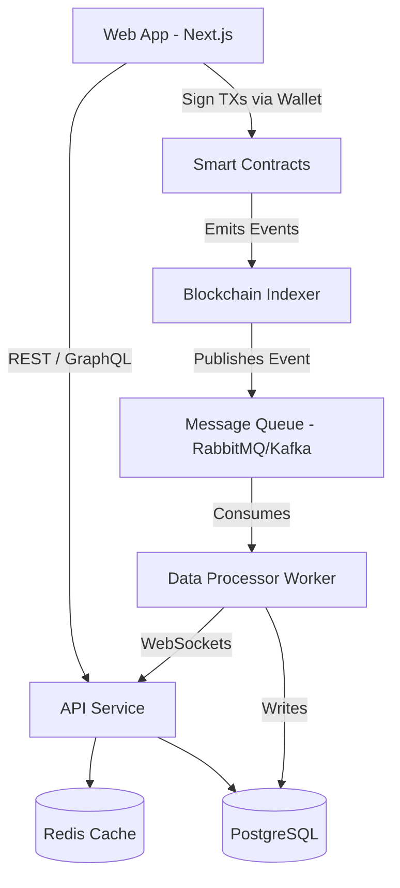

# Distributed Web3 Budgeting: An Event-Driven Microservices Architecture

This project is a demonstration of bridging decentralized networks with traditional, scalable backend systems. By decoupling the smart contract state from the frontend reading layer, it eliminates the inherent bottlenecks of querying a blockchain directly.

Using an event-driven microservices approach, on-chain transactions are consumed by a dedicated indexer, processed through a message queue, and persisted into a relational database. This architecture allows the backend API to serve complex queries and real-time WebSocket updates to the client instantly, representing a production-grade approach to Web3 software engineering.

## 1. System Architecture



## 2. The Upgraded Tech Stack

### Smart Contracts (The Trust Layer)
*   **Language:** Solidity
*   **Framework:** Foundry (much faster testing than Hardhat)
*   **Role:** Holds funds, enforces budget limits cryptographically, and emits events (`BudgetCreated`, `ExpenseRecorded`, `FundsAdded`).
*   **Deployment:** Testnet (e.g., Sepolia or Arbitrum Goerli) via automated CI/CD scripts.

### Backend & API (The Distributed Layer)
*   **API Service (Go or Node.js/NestJS):** Handles off-chain user data, serves dashboard analytics, and manages authentication (e.g., SIWE - Sign In With Ethereum).
*   **Database (PostgreSQL):** Stores user profiles, off-chain metadata (e.g., custom category names), and a mirrored, highly-indexed version of the blockchain transaction history.
*   **Blockchain Indexer (Subsquid / The Graph / Custom Node Service):** Listens to your smart contract events in real-time. This is the secret to scaling Web3 apps—you query your fast Postgres DB, not the blockchain.
*   **Message Queue (RabbitMQ / Kafka):** Decouples the indexer from the main API. When the indexer sees a new on-chain transaction, it pushes it to the queue.
*   **Caching (Redis):** Caches heavy analytics queries (e.g., "Monthly spending by category") so the dashboard loads instantly.

### Frontend (The User Interface)
*   **Framework:** Next.js (React) + Tailwind CSS (using premium UI libraries like shadcn/ui or Aceternity).
*   **Web3 Integration:** `wagmi` + `viem` for wallet connection (MetaMask, WalletConnect).
*   **Data Fetching:** React Query for caching API responses and managing loading states.

## 3. Upgraded Feature Set (Production-Ready)

1.  **Hybrid On-Chain/Off-Chain Analytics:**
    *   *Old way:* Fetching all transactions from the contract (slow, expensive RPC calls).
    *   *New way:* API aggregates data from PostgreSQL (fast) to instantly render beautiful spending charts and monthly limits.
2.  **Event-Driven UI Updates:**
    *   When an expense is recorded on-chain, the Indexer picks it up -> MQ -> API -> **WebSockets**. The user's dashboard updates in real-time without refreshing the page.
3.  **Abnormal Spending Detection (Background Worker):**
    *   A background Python or Go worker consumes the message queue and analyzes spending patterns. If a transaction is highly unusual (e.g., 500% higher than average), the system flags it in the DB and sends an alert.
4.  **Distributed Cloud Deployment:**
    *   **Containers:** Dockerize the API, Indexer, and DB.
    *   **Cloud:** Deploy the API and Workers via Google Cloud Run or AWS ECS (serverless containers).
    *   **CI/CD:** GitHub Actions to run smart contract tests and automatically deploy the backend services when merged to `main`.

---

## 4. Getting Started

Follow these steps to run the complete distributed system locally.

### Smart Contracts
1. Navigate to the `contracts` directory:
   ```bash
   cd contracts
   ```
2. Install dependencies:
   ```bash
   npm install
   ```
3. Compile the contracts:
   ```bash
   npx hardhat compile
   ```
4. Run a local Hardhat node (simulated blockchain):
   ```bash
   npx hardhat node
   ```

### Backend API & Indexer
1. Navigate to the `backend` directory:
   ```bash
   cd backend
   ```
2. Install dependencies:
   ```bash
   npm install
   ```
3. Start the server (which also starts the simulated indexer):
   ```bash
   npm run dev
   ```
   The API will be available at `http://localhost:3001`.

### Frontend Web App
1. Navigate to the `frontend` directory:
   ```bash
   cd frontend
   ```
2. Start the frontend development server:
   ```bash
   npm run dev
   ```
   The web app will be available at `http://localhost:3000`.
